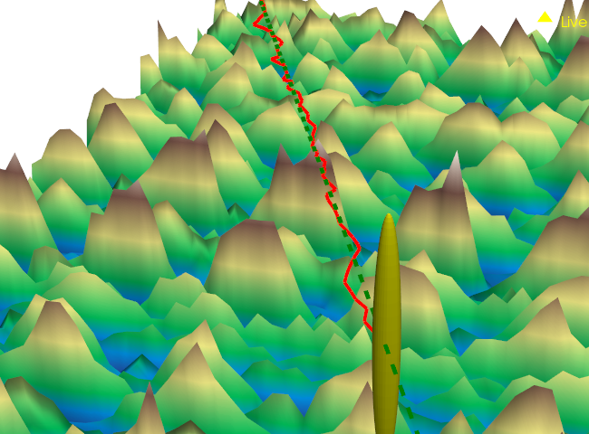
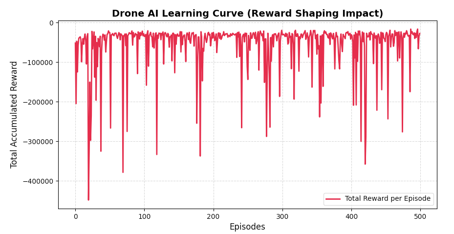

# 🛸 Drone Navigation & Drift Correction using Q-Learning

An autonomous flight simulation powered by Reinforcement Learning (RL) designed to correct drone flight trajectory drift over complex topographic environments without relying on GPS stabilization.

---

## 📸 Simulation Preview


## 📊 Drone AI Learning Curve


---

## 🌍 Key Features
* **Real-World Topography:** Utilizes actual Digital Elevation Model (DEM) data via **NASA SRTM GL1** for the mountainous region of **Tangier-Tétouan, Morocco** (`output_SRTMGL1.tif`).
* **Physics-Informed RL:** Integrates aerodynamics and gravity constraints to simulate real-world environmental drift.
* **Data Optimization:** Safely downsampled original DEM dimensions (1075 x 2367) into an optimized **54 x 119 grid** for fluid 3D rendering using **PyVista**.
* **Autonomous Adaptation:** Trains a Q-learning agent to predict and counter drift vectors actively, saving state baselines into an exportable matrix (`q_table.pkl`).

## 🛠️ Technical Stack
* **Language:** Python 3.9+
* **Core Libraries:** NumPy, Pandas, Matplotlib
* **Geospatial & Vision:** Pillow / Geospatial Array Parsing / VTK Structured Grid

## 🚀 How to Run Locally
1. Clone the repository:
```bash
   git clone [https://github.com/isphada2002-tech/drone-ai-project.git](https://github.com/isphada2002-tech/drone-ai-project.git)
   cd drone-ai-project
2. Run the main training agent:
´´´´bash
    python "droneAI agent.py"


